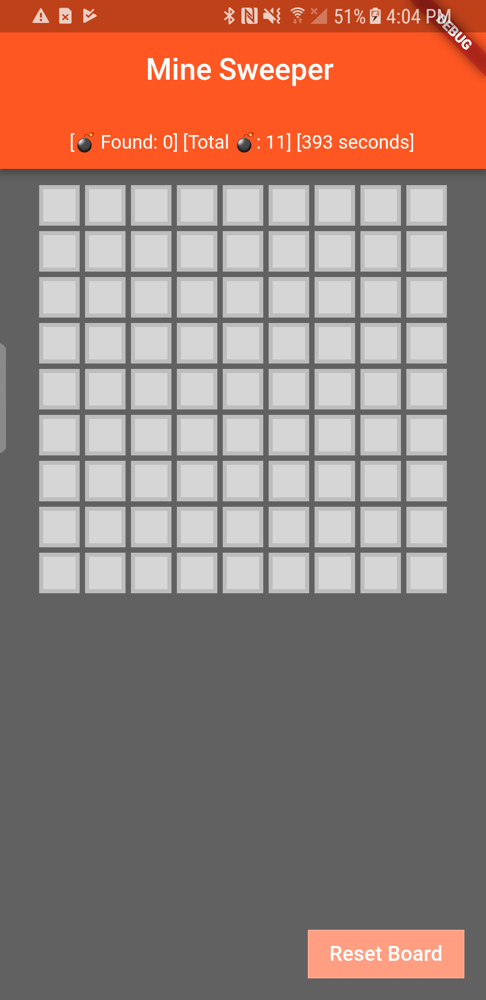
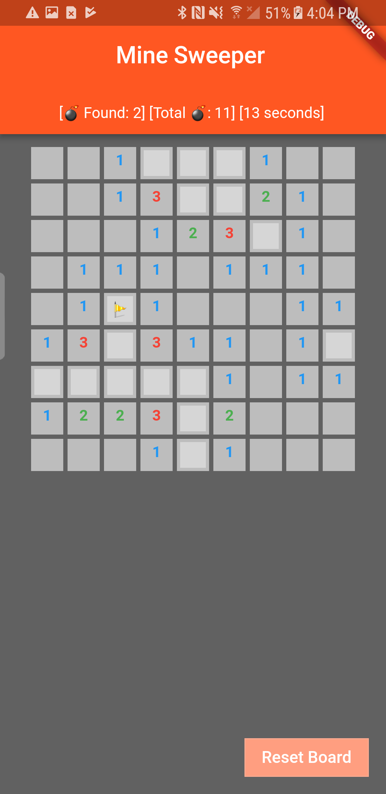
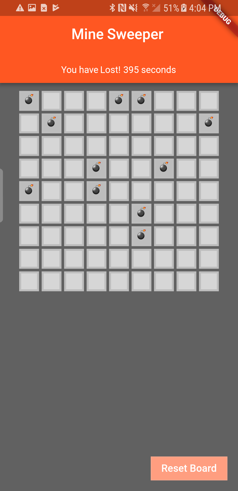

    <h1>Flutter Mine Sweeper Application</h1>
    
A Flutter Mine Sweeper Application Demo

    
    
    

## Instructions
Flutter Mine Sweeper is an Android Mine Sweeper game which built by using Flutter.
#### To build this application, following techniques are used:  
- Dart 2
- Flutter Beta

## Getting Started

For help getting started with Flutter, view our online
[documentation](https://flutter.io/).

## Demos

